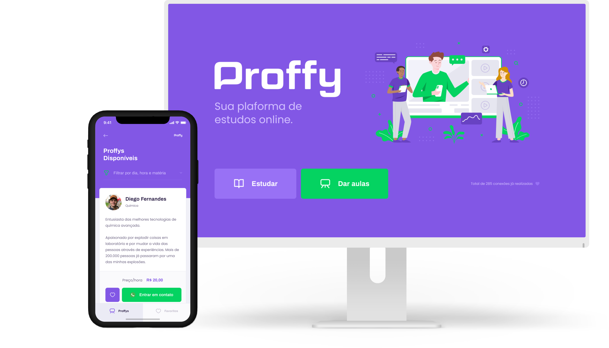

<h1 align="center">
    
</h1>

**Proffy** foi um projeto desenvolvido na **Next Level Week** promovido pela Rocketseat.
A proposta do projeto é uma aplicação que possa ligar quem deseja aprender, e quer ensinar. É possível encontrar alunos para selecionar, ou encontrar o professor para aquela matéria que você sempre quis aprender mais! Sem que haja nenhuma limitação de área!!

<hr>

## Previews

<h1 align="center">
    
</h1>
<hr>

<p align="center"> 
<a href="https://gyazo.com/29a1f3ab47b527185f5a07c0865d4408"></a> <a href="https://gyazo.com/0a811fa80f08c3111da14ffb1427d674"></a>
 <p>

<hr>
<b>Pergunta:</b> Sobre o que é o projeto?

<b>Resposta:</b> A proposta do projeto é uma aplicação que possa ligar quem deseja aprender, e quer ensinar. É possível encontrar alunos para selecionar, ou encontrar o professor para aquela matéria que você sempre quis aprender mais! Sem que haja nenhuma limitação de área!! <br>
<b>Resposta:</b> O NLW é uma semana prática com muito código, desafios e networking desenvolvido pela RocketSeat.<br>
<b>Pergunta:</b> Quais são as tecnologias usadas neste projeto?<hr>

<b>Resposta:</b> As tecnologias usadas neste projeto são...

✅ HTML 5 <br>
✅ CSS 3<br>
✅ JavaScipt<br>
✅ SQLite<hr>

## Ferramentas utilizadas

- [Git Bash](https://gitforwindows.org/)
- [Node.js](https://nodejs.org/en/download/)
- [Nunjucks](https://www.npmjs.com/package/nunjucks)
- [SQLite](https://www.sqlite.org/download.html)
---

## 🚀 Como rodar o projeto

Podemos considerar este projeto como sendo divido em duas partes:

1. Front End (pasta src/server)
2. Back End (pasta src/database)

### Pré-requisitos

Antes de começar, você vai precisar ter instalado em sua máquina as seguintes ferramentas:
[Git-Bash](https://git-scm.com), [Node.js](https://nodejs.org/en/).
Além disto é bom ter um editor para trabalhar com o código como _VSCode_


### Rodando a aplicação web (Front End)

```bash
# Clone este repositório
$ git clone https://github.com/gvqz18/Projeto_NLW2

# Acesse a pasta do projeto no seu terminal/cmd
$ cd nlw-2

# Vá para a pasta da aplicação Front End
$ cd src/server.js

# Instale as dependências
$ npm install

# Execute a aplicação em modo de desenvolvimento
$ npm run dev

# A aplicação será aberta na porta:3333 - acesse http://localhost:5500

```

## 📝 Licença

Esse projeto está sob a licença MIT. Veja o arquivo [LICENSE](LICENSE.md) para mais detalhes.

---
<h3 align="center">

   
</h3>
